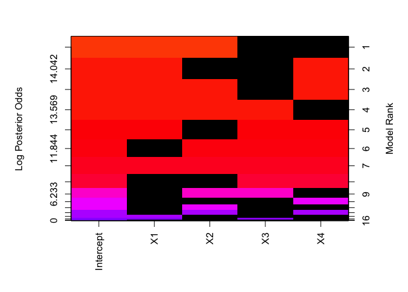

<!-- README.md is generated from README.Rmd. Please edit that file -->
[BAS: An R package for Bayesian Model Averaging using Adaptive Samping](https://github.com/merliseclyde/BAS)
============================================================================================================

The `BAS` [R](http://r-project.org) package is designed to provide an easy to use package and fast code for implementing Bayesian Model Averaging and Model Selection in `R` using state of the art prior distributions for linear and generalized linear models. The prior distributions in `BAS` are based on Zellner's g-prior or mixtures of g-priors. These have been shown to be consistent and have a number of computational advantages. `BAS` implements two main algorithms for sampling from the space of potential models: an adaptive sampling without replacement algorithm and a MCMC algorithm that utilizes swapping to escape from local modes.

Some CRAN statistics: [](http://cran.rstudio.com/web/packages/BAS/index.html) [](http://cran.rstudio.com/web/packages/BAS/index.html)

Current release DOI v1.3.1 [](http://dx.doi.org/10.5281/zenodo.60948)

DOI version v1.3.0 [](http://dx.doi.org/10.5281/zenodo.59497)

Installation
------------

The stable version [](https://cran.r-project.org/package=BAS) can be installed easily in the `R` console like any other package:

``` r
install.packages('BAS')
```

On the other hand, I welcome everyone to use the most recent version of the package with quick-fixes, new features and probably new bugs. It's currently hosted on [GitHub](https://github.com/merliseclyde/BAS). To get the latest development version from [GitHub](https://github.com/merliseclyde), use the `devtools` package from [CRAN](https://cran.r-project.org/package=devtools) and enter in `R`:

``` r
devtools::install_github('merliseclyde/BAS')
```

You can check out the current build and test coverage status courtesy Travis CI: [](https://travis-ci.org/merliseclyde/BAS) before installing.

Installing the package from source does require compilation of C and FORTRAN code as the library makes use of BLAS and LAPACK for efficient model fitting. See [CRAN manuals](https://cran.r-project.org/doc/manuals/r-devel/R-admin.html) for installing packages from source under different operating systems.

Usage
-----

To begin load the package:

``` r
library(BAS)
```

The two main function in `BAS` are `bas.lm` and `bas.glm` for implementing Bayesian Model Averaging and Variable Selection using Zellner's g-prior and mixtures of g priors. Both functions have a syntax similar to the `lm` and `glm` functions respectively. We illustrate using `BAS` on a simple example with the famous Hald data set using the Zellner-Siow Cauchy prior via

``` r
data(Hald)
hald.ZS = bas.lm(Y ~ ., data=Hald, prior="ZS-null", modelprior=uniform(), method="BAS")
```

`BAS` has `summary`, `plot` `coef`, `predict` and `fitted` functions like the `lm`/`glm` functions. Images of the model space highlighting which variable are important may be obtained via

``` r
image(hald.ZS)
```



Run `demo("BAS.hald")` or `demo("BAS.USCrime")` or see the package vignette for more examples and options such as using MCMC for model spaces that cannot be enumerated.

### Generalized Linear Models

`BAS` now includes for support for binomial and binary regression and poisson regression using Laplace approximations to obtain Bayes Factors used in calculating posterior probabilities of models or sampling of models. Here is an example using the Pima diabetes data set with the hyper-g/n prior:

``` r
library(MASS)
data(Pima.tr)
Pima.hgn = bas.glm(type ~ ., data=Pima.tr, method="BAS", family=binomial(),
                  betaprior=hyper.g.n(), modelprior=uniform())
```

Note, the syntac for specifying priors on the coefficients in `bas.glm` uses a function with arguments to specify the hyperparameters, rather than a text string to specify the prior name and a separate argument for the hyperpameters. `bas.lm` will be moving to this format sometime in the future.

Feature Requests and Issues
---------------------------

Feel free to report any issues or request features to be added via the github page.
